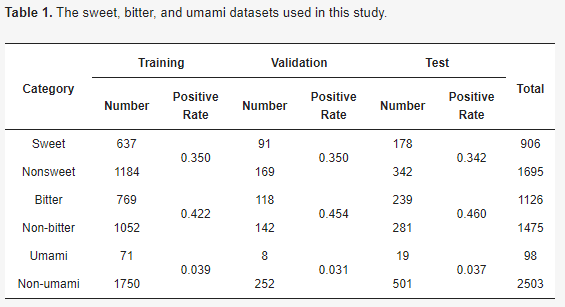
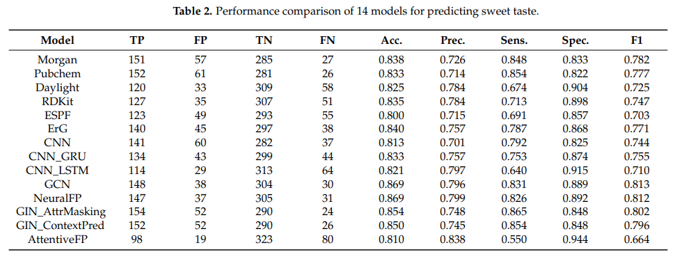
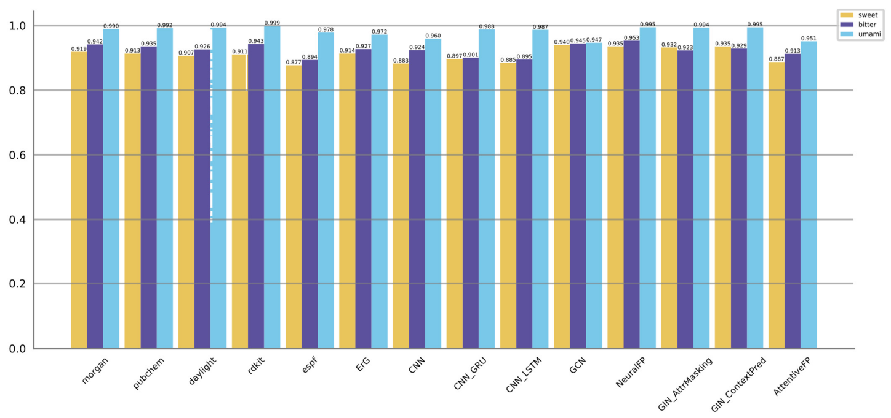

# A Comprehensive Comparative Analysis of Deep Learning Based Feature Representations for Molecular Taste Prediction

[**Papar**](https://www.mdpi.com/2304-8158/12/18/3386/htm) | [**Citation**](#citation)

This repository contains the official code for this paper:A Comprehensive Comparative Analysis of Deep Learning Based Feature Representations for Molecular Taste Prediction

## Data
The 'tastes_split' folder contains three types of dataset used in our experiment.



## Performance
we tested 14 models,including six fingerprint models, three CNN-RNN models and five GNN models in our dataset. The following table and figure are one of the three types of tastes.The model implementation is supported by [DeepPurpose](https://github.com/kexinhuang12345/DeepPurpose) package.



The 'result' folder contains the data from our experiment along with instructions on how to calculate metrics and create bar graphs.

Showcases of AUROC scores



## Citation
If you find this repository useful, please cite our paper using
````
@Article{foods12183386,
    AUTHOR = {Song, Yu and Chang, Sihao and Tian, Jing and Pan, Weihua and Feng, Lu and Ji, Hongchao},
    TITLE = {A Comprehensive Comparative Analysis of Deep Learning Based Feature Representations for Molecular Taste Prediction},
    JOURNAL = {Foods},
    VOLUME = {12},
    YEAR = {2023}
}
````